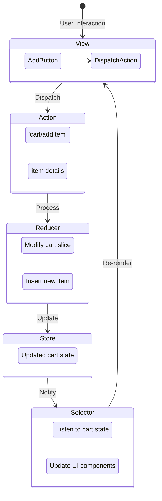

```mermaid

stateDiagram-v2
    [*] --> View : User Interaction
    state View {
        direction LR
        AddButton --> DispatchAction
    }
    
    state Action {
        direction LR
        ActionType : 'cart/addItem'
        Payload : item details
    }
    
    state Reducer {
        direction LR
        UpdateState : Modify cart slice
        AddItem : Insert new item
    }
    
    state Store {
        direction LR
        CartSlice : Updated cart state
    }
    
    state Selector {
        direction LR
        Subscribe : Listen to cart state
        Render : Update UI components
    }
    
    View --> Action : Dispatch
    Action --> Reducer : Process
    Reducer --> Store : Update
    Store --> Selector : Notify
    Selector --> View : Re-render
    
```
